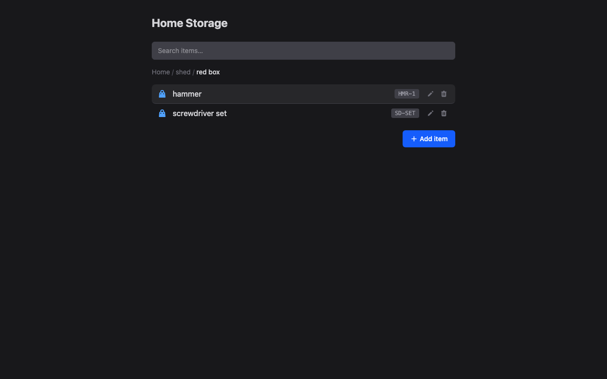
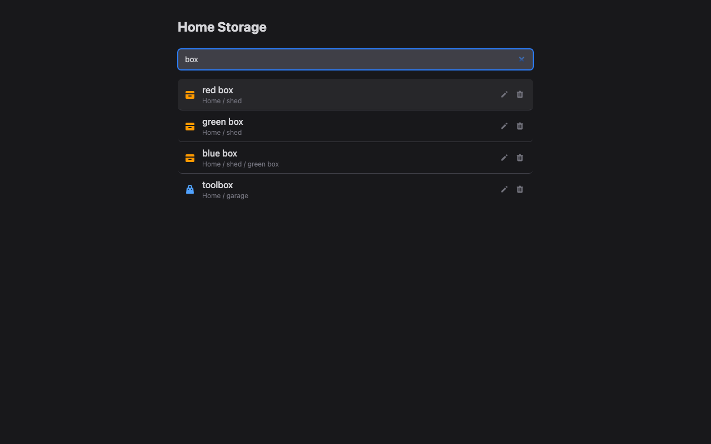
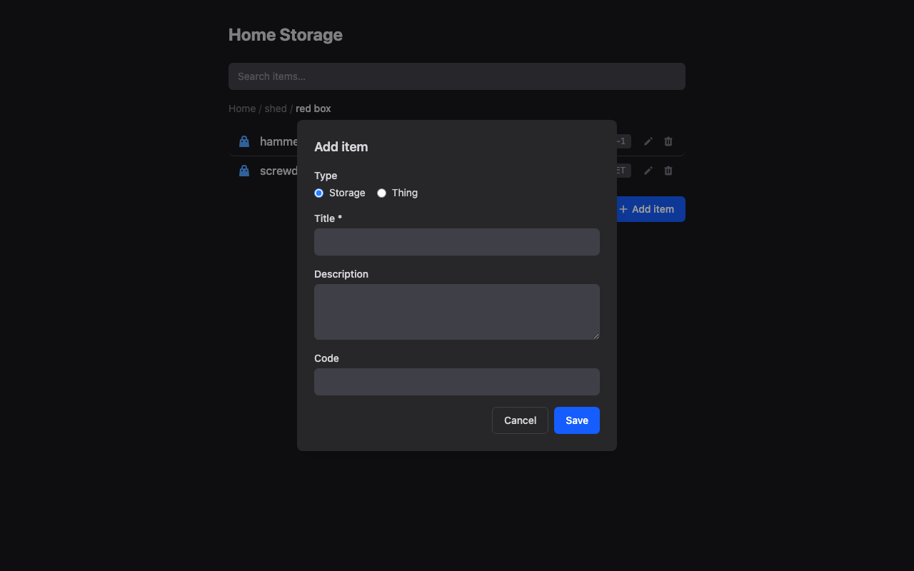

# Home Storage

A personal inventory app for tracking physical items and the spaces they live in. Build a tree of storage locations — rooms, shelves, boxes — and record what's in each one. Navigate the hierarchy, move things around, and search across everything.

## Features

- **Hierarchical storage tree** — nest storage locations (shelves inside rooms, boxes on shelves, etc.)
- **Items with codes** — assign short reference codes to anything for quick lookup
- **Live search** — find items by name across the entire inventory
- **Move anywhere** — reparent any node to a different location
- **Breadcrumb navigation** — always know where you are in the hierarchy

## Screenshots

**Browsing a storage location** — breadcrumb shows where you are; click any location to drill down. Items display their short reference codes.



**Live search** — results appear as you type, each showing its full path in the hierarchy. Matches both storage locations and individual items.



**Adding an item** — choose between a storage location or a thing, give it a title, description, and optional short code.



## Stack

| Layer | Tech |
|---|---|
| API | Ruby on Rails 8, PostgreSQL |
| Frontend | React 19, TypeScript (strict), Tailwind CSS 4 |
| Server state | React Query v5 |
| Tree structure | [`ancestry`](https://github.com/stefankroes/ancestry) gem |
| Testing | RSpec + FactoryBot / Vitest + React Testing Library |
| Infrastructure | Docker Compose, Kamal |

## Getting Started

**Prerequisites:** Docker and Docker Compose.

```bash
# Start all services
docker compose up

# Seed the database (first time)
docker compose exec web bundle exec rails db:seed
```

The Rails API runs on **port 3000** and the Vite dev server on **port 5173**. Open `http://localhost:5173` in your browser.

## Development

```bash
# Rails console
docker compose exec web bundle exec rails c

# Run backend tests
docker compose exec web bundle exec rspec

# Run frontend tests
docker compose exec frontend npm run test

# Lint Ruby
docker compose exec web bundle exec rubocop

# Lint TypeScript
docker compose exec frontend npm run lint
```

## Project Structure

```
app/
  controllers/api/v1/   # Thin JSON controllers
  models/               # Node model (ancestry-backed tree)
  services/nodes/       # Business logic: Create, Move, Destroy

frontend/src/
  components/           # React components (NodeBrowser, NodeForm, SearchBar, …)
  hooks/                # React Query hooks (useNode, useNodes, useSearchNodes, …)
  services/             # API client (nodesService.ts)
  types/                # Shared TypeScript types

spec/                   # RSpec tests (mirrors app/ structure)
```

## API

All endpoints live under `/api/v1/nodes`. Responses follow the shape `{ data: ... }` on success and `{ errors: [...] }` on failure.

| Method | Path | Description |
|---|---|---|
| `GET` | `/api/v1/nodes` | Root nodes (or `?parent_id=`, `?q=`, `?flat=true`) |
| `GET` | `/api/v1/nodes/:id` | Single node with path + children |
| `POST` | `/api/v1/nodes` | Create a node |
| `PATCH` | `/api/v1/nodes/:id` | Update or move a node |
| `DELETE` | `/api/v1/nodes/:id` | Delete a node (must be empty) |

## Data Model

There is a single `Node` model with two types:

- **`storage`** — a location that can contain other nodes (rooms, shelves, boxes)
- **`thing`** — a leaf item that cannot have children

Each node has a `title` (required), optional `description`, and an optional unique `code` for quick reference.
